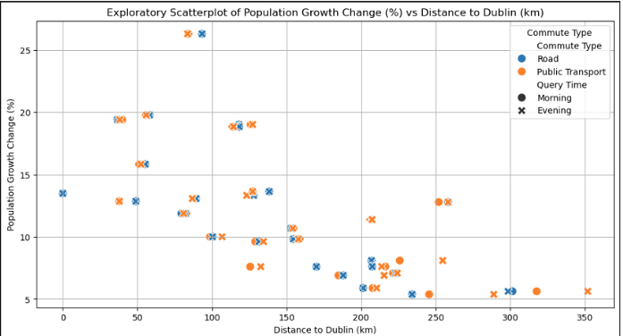
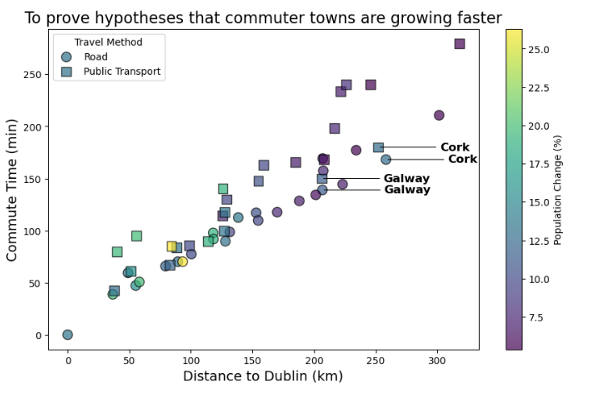

# Population Growth vs Commute Distance in Ireland

## Overview
This project explores the relationship between population growth, commute distance, and commute time from major towns in Ireland to Dublin. The objective was to test whether towns closer to Dublin experienced higher population growth, using commute data and population change analysis.

## Problem Statement
Population growth is often influenced by accessibility to employment hubs, transport links, and urban infrastructure. This project investigates whether Irish towns with shorter commute distances and times to Dublin showed stronger population growth between 2006 and 2016.

## Data Collection
The dataset was created using the Google Distance Matrix API to collect commute distance and commute time data from the largest town in each Irish county to Dublin city. Data was collected at fixed time points to improve consistency:
- 9 AM
- 7 PM

The final dataset includes both commute metrics and population growth data for further analysis.

## Dataset Columns
- County
- Reference Town
- Commute Type
- Distance to Dublin (km)
- Commute Time (min)
- Query Time
- Population Change (%)

## Tools and Technologies
- Python
- Pandas
- Matplotlib
- Seaborn
- Google Distance Matrix API
- Jupyter Notebook

## Methodology
1. Collected commute distance and travel time data using Google Distance Matrix API.
2. Cleaned and structured the dataset for analysis.
3. Added population growth information to the dataset.
4. Created exploratory visualizations to identify patterns and outliers.
5. Designed an explanatory visualization to clearly communicate the relationship between population growth, commute distance, and commute time.
6. Interpreted findings and highlighted exceptions such as Cork and Galway.

## Key Visualizations
- Bar chart showing population change growth for each reference town
- Exploratory scatterplot of population growth vs distance to Dublin
- Explanatory scatterplot showing commute time, distance to Dublin, and population change

## Key Findings
- Towns closer to Dublin generally showed higher population growth.
- A visible relationship was observed between shorter commute distance and stronger growth.
- Cork and Galway appeared as outliers, likely because they are major urban centres with their own economic pull.
- The explanatory scatterplot was chosen because it effectively shows the link between distance, commute time, and population growth in a single view.

## Screenshots
Add your screenshots here.

Example:

Note: The original source notebook is unavailable in this repository, so the implementation is documented through the report, presentation, visual outputs, and code snippets included in the appendix.
# Population-growth-vs-Cummute-Time-Analysis-in-Ireland
